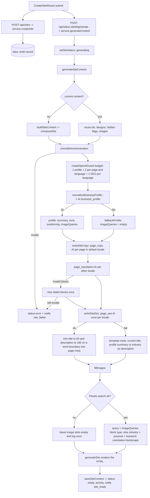

# Generation flow

The first site generation path, from the wizard submit to the saved, rendered site.

```mermaid
flowchart TD
  A[CreateSiteWizard submit] --> B[POST /api/sites -> service.createSite]
  B --> C[(sites: draft record)]
  A --> D[POST /api/sites/:siteId/generate -> service.generateContent]
  D --> E[setSiteStatus: generating]
  E --> F[generateSiteContent]
  F --> G{current content?}
  G -- no --> H[buildSiteContent -> composeSite]
  G -- yes --> I[reuse ids, designs, hidden flags, images]
  H --> J[checkBeforeGeneration]
  I --> J
  J -- invalid --> ERR[status error + notify site_failed]
  J --> K[createSpendGuard budget: 1 profile + 2 per page and language + 1 SEO per language]
  K --> L[normalizeBusinessProfile -> AI business_profile]
  L -- ok --> M[profile: summary, tone, positioning, imageQueries]
  L -- fail --> N[fallbackProfile: imageQueries = empty]
  M --> O[writeSiteCopy: page_copy AI per page in default locale]
  N --> O
  O --> P[page_translation AI per other locale]
  P -- invalid blocks --> Q[retry failed blocks once]
  Q -- still invalid --> ERR
  P --> R[writeSiteSeo: page_seo AI once per locale]
  Q --> R
  R -- ok --> S[trim title to 60 and description to 160 on a word boundary into page.meta]
  R -- fail --> T[template meta: current title, profile summary or industry as description]
  S --> U[fillImages]
  T --> U
  U --> V{Pexels search ok?}
  V -- no --> W[leave image slots empty and log once]
  V -- yes --> X[query = imageQueries block type, else industry + purpose + keyword; orientation=landscape]
  W --> Y[generateSite renders the HTML]
  X --> Y
  Y --> Z[saveSiteContent -> status ready, activity, notify site_ready]
```
